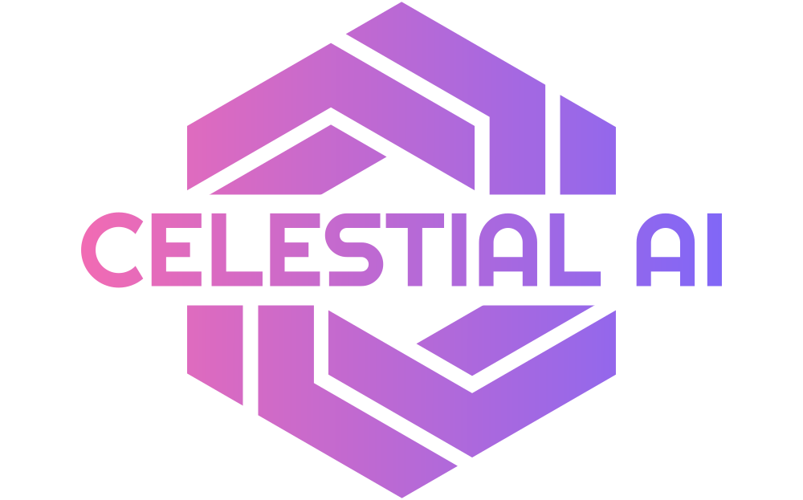
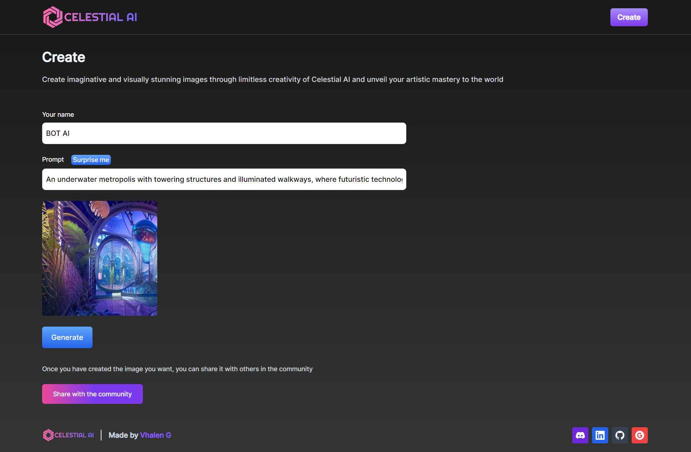

<!-- Improved compatibility of back to top link: See: https://github.com/othneildrew/Best-README-Template/pull/73 -->

<a name="readme-top"></a>

<!--
*** Thanks for checking out the Best-README-Template. If you have a suggestion
*** that would make this better, please fork the repo and create a pull request
*** or simply open an issue with the tag "enhancement".
*** Don't forget to give the project a star!
*** Thanks again! Now go create something AMAZING! :D
-->

<!-- PROJECT SHIELDS -->
<!--
*** I'm using markdown "reference style" links for readability.
*** Reference links are enclosed in brackets [ ] instead of parentheses ( ).
*** See the bottom of this document for the declaration of the reference variables
*** for contributors-url, forks-url, etc. This is an optional, concise syntax you may use.
*** https://www.markdownguide.org/basic-syntax/#reference-style-links
-->

<!-- PROJECT LOGO -->
<br />
<div align="center">
  <a href="https://aiv14chat.vercel.app">
    
  </a>

  <h3 align="center">Chatbot AI</h3>

  <p align="center">
    An awesome AI Image Generator!
    <br />
    <a href="https://aiv14chat.vercel.app"><strong>Check the website »</strong></a>
    <br />
    <br />
  </p>
</div>

<!-- TABLE OF CONTENTS -->
<details>
  <summary>Table of Contents</summary>
  <ul>
    <li>
      <a href="#about-the-project">About The Project</a>
      <ul>
        <li><a href="#built-with">Built With</a></li>
      </ul>
    </li>
    <li>
      <a href="#getting-started">Getting Started</a>
      <ul>
        <li><a href="#prerequisites">Prerequisites</a></li>
        <li><a href="#installation">Installation</a></li>
      </ul>
    </li>
    <li><a href="#usage">Usage</a></li>
  </ul>
</details>

<!-- ABOUT THE PROJECT -->

## About The Project


<br />
<br />
<p>
This is Chatbot AI, a sophisticated software program designed to understand and generate human-like language. Powered by Open AI.

My purpose is to provide instant and personalized assistance to users, whether it's helping customers find a product, answering frequently asked questions, or providing customer support. By automating routine tasks and providing immediate responses, I can save time and increase operational efficiency for businesses, while also improving the overall user experience for customers.

I can be integrated into a wide range of platforms, including messaging apps, websites, and mobile apps. With my ability to learn from past conversations and adapt to user needs, I can provide personalized experiences and build stronger relationships with users.

</p>
<br />
<br />

### Built With

- [![Node][Node.js]][Vite-url]
- [![Express][Express]][Express-url]
- [![Vite][Vite.js]][Vite-url]
- [![Vercel][Vercel]][Vercel-url]
- [![OpenAI][OpenAI]][OpenAI-url]

<!-- GETTING STARTED -->

## Getting Started

This is an example of how you may give instructions on setting up your project locally.
To get a local copy up and running follow these simple example steps.

### Prerequisites

This is an example of how to list things you need to use the software and how to install them.

- npm
  ```sh
  npm install npm@latest -g
  ```

### Installation

_Below is an example of how you can instruct your audience on installing and setting up your app. This template doesn't rely on any external dependencies or services._

1. Get a free API Key at [https://openai.com/](https://openai.com/)
2. Clone the repo
   ```sh
   git clone https://github.com/VhalennnG/AI_Chat_Generator.git
   ```
3. Install NPM packages
   ```sh
   npm install
   ```
4. Enter your API in `config.js`
   ```js
   const API_KEY = "ENTER YOUR API";
   ```

<!-- USAGE EXAMPLES -->

## Usage

Use this Chatbot AI to provide instant and personalized assistance to users, whether it's helping customers find a product, answering frequently asked questions, or providing customer support. By automating routine tasks and providing immediate responses, I can save time and increase operational efficiency for businesses, while also improving the overall user experience for customers.

<!-- CONTACT -->

## Contact

Vhalen_G - [vhalentinog@gmail.com](mailto:vhalentinog@gmail.com)

Project Link: [AI Chat Generator](https://github.com/VhalennnG/AI_Chat_Generator)

<!-- MARKDOWN LINKS & IMAGES -->
<!-- https://www.markdownguide.org/basic-syntax/#reference-style-links -->

[product-screenshot]: images/Screenshot.png
[Vite.js]: https://img.shields.io/badge/vite.js-646CFF?style=for-the-badge&logo=vite&logoColor=white
[Vite-url]: https://vitejs.dev/
[Express]: https://img.shields.io/badge/express-000000?style=for-the-badge&logo=express&logoColor=white
[Express-url]: https://expressjs.com/
[Node.js]: https://img.shields.io/badge/node.js-339933?style=for-the-badge&logo=nodedotjs&logoColor=white
[Node-url]: https://nodejs.org/en
[Vercel]: https://img.shields.io/badge/vercel-000000?style=for-the-badge&logo=vercel&logoColor=white
[Vercel-url]: https://vercel.com/
[OpenAI]: https://img.shields.io/badge/openai-412991?style=for-the-badge&logo=openai&logoColor=white
[OpenAI-url]: https://openai.com/
